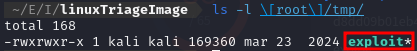
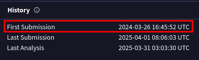
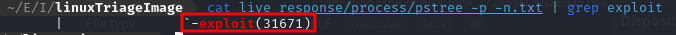
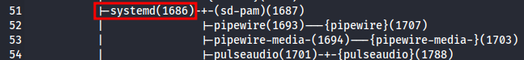
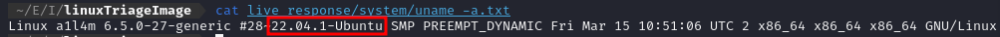
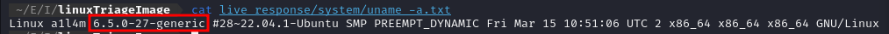
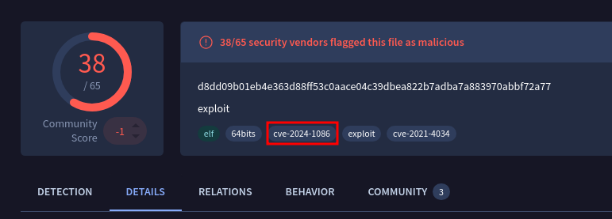

# IS-3.c.02-ACF

1. ***¿Cuál es el nombre del archivo clave que el intruso descargó para escalar privilegios después de obtener acceso no autorizado?***

    **Respuesta:** exploit

    Buscamos en la carpeta temporal donde se guarda el exploit.

    

---

2. ***¿Cuándo fue enviado por primera vez a VirusTotal el archivo utilizado para la escalada de privilegios?***

    **Respuesta:** 2024-03-26 16:45:52 UTC

    Para buscar la primera fecha, subimos a VirusTotal el exploit, y nos aparece la primera fecha como **First Submission**:
    
    

---

3. ***¿Cuál es el ID de proceso (PID) de la operación lanzada por el atacante?***

    **Respuesta:** 31671

    Para buscar el proceso buscamos en el comando pstree, donde encontramos un proceso relacionado con el exploit:

    

---

4. ***¿Con qué nombre de usuario se estaba ejecutando el proceso malicioso?***

    **Respuesta:** a1l4m

    Buscando en el archivo hostname encontramos el usuario *a1l4m* que es el usuario que ejecutó el exploit.

    

---

5. ***¿Cuál es el ID de proceso padre (PPID) asociado al proceso malicioso?***

    **Respuesta:** 1686

    Si buscamos en el fichero del pstree, al igual que en la pregunta 3, encontraremos el proceso padre:

    

---

6. ***¿Cuál es el sistema operativo y su versión en el servidor comprometido?***

    **Respuesta:** 22.04.1-Ubuntu

    Para buscar el sistema operativo lo encontramos en el fichero uname -a.

    

---

7. ***¿Cuál es la versión del kernel del sistema comprometido?***

    **Respuesta:** 6.5.0-27-generic

    Al igual que en la pregunta 6, se encuentra en el fichero uname -a.

    

---

8. ***¿Cuál es el número de CVE más reciente asociado a las vulnerabilidades explotadas en este ataque?***

    **Respuesta:** CVE-2024-1086

    En VirusTotal encontramos el CVE más reciente.

    

---